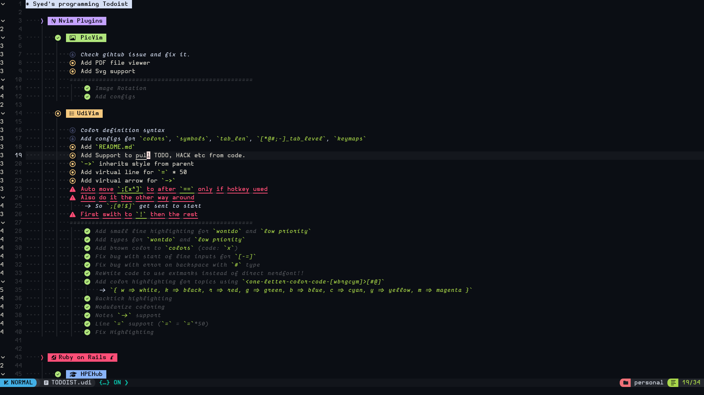

# UdiVim - A MarkUp language.

> UDI stands for User Do It

It is a simple todo file format for handling your tasks.

## Features

- It renders to a neovim buffer.
- It handles neovim shortcuts for fast typing.
- It allows shortcuts to mark tasks as done etc.
- It can be easily interpreted by other programs. And human readers.

## Screenshot



## Syntax

### General

#### Colors

The colors are defined by using the following pattern

- `w` = white
- `k` = black
- `e` = gray
- `r` = red
- `g` = green
- `b` = blue
- `c` = cyan
- `m` = magenta
- `y` = yellow
- `t` = tan
- `o` = orange
- `p` = pink

```lua
local colors = {
	w = "#d6e0f5",
	k = "#0a0b11",
	e = "#3b415e",
	r = "#ff4f78",
	g = "#b0e57c",
	b = "#89b4fa",
	c = "#8cdcff",
	m = "#c5a3ff",
	y = "#f5c97f",
	t = "#be8c71",
	o = "#ff9e64",
	p = "#ff99c2",
}
```

#### Task modes

Tasks can be marked as

- Todo `(0)`
- Done `(x)`
- Unimportant `($)`
- Important `(!)`
- Won't do `(^)`

### Topic

- A topic is defined by starting a line with an asterisk (*).
- It is always colored white bg with black fg.

### SubTopic

- A subtopic is defined by starting a line with a color code followed by a hash (#).
- It takes the bg color as coded and an appropriate fg color.

### Problem

- A problem is defined by starting a line with a color code followed by an at symbol (@) and then a task mode.
- ex: `d@0 Problem`
- It takes the bg color as coded and an appropriate fg color.
- And shows a marking based on the task mode.

### Task

- A task is defined by starting a line with a semicolon (;) followed by a task mode.
- ex: `;0 TODO`
- It takes colors based on the task mode.
- And shows a marking based on the task mode.

### Separator

- A separator is defined by starting a line with a `=` and can have as many `=` as you want.
- Its should be at the indentation level of the required seperate blocks you need.

## Example

```
* Topic

    m# SubTopic:

        d@0 Problem

            ;! Task

        d@x hello?

            ;0 IDK
            ;! Hello
            ;x I SHOE

        c@0 FUN

            ;0 Why?
            ;! MAYBE
            ;x NOO
            ==================================================
                ;x Hello
```

